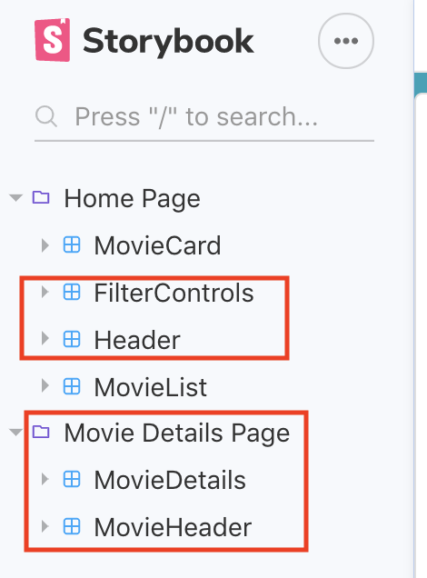

# Assignment 1 - ReactJS app.

Name: Gowriswarup Kailas Perumal

## Overview.

This Assignment is a React App for displaying a Movies App Database.

### Features.

[ A bullet-point list of the __new features__ you added to the Movies Fan app (and any modifications to existing features) .]

- Shows the currently playing movies
- Shows the currently top rated movies
- Shows the currently trending movies
- Shows the upcoming movies
- Shows the list of popular actors
- Attempt at Auth0 authentication

## Setup requirements.

Setup and initial configuration after cloning repo includes the following for optimal functionality:

1.  run the following command in the integrated terminal
    '''npm install'''
    in the integrated terminal to install the prerequisites.

2.  The TMDB API is used for gathering the movies app data. An API Key that is used to authenticate the API requests can be collectd using the method below.
    Signup for an account here.
    Log in to your account. To get a key, follow this sequence:

        '''Settings > API > Create > Click on Request an API > Click "Developer" > Fill in Details'''

3.  To install the auth0 prerequisited, run the following command in the integrated terminal
    '''npm install @auth0/auth0-react'''

## API endpoints.

- Now Playing Movies - discover/movie
- Top Rated Movies - movie/:id
- Trending Movies -
- Upcoming Movies
- Popular Actors
- Auth0 authentication prior to landing page

## App Design.

### Component catalogue.

[ Insert a screenshot from the Storybook UI that lists all the stories for the app's components, and highlight those relating to your __new/modified components__ - see the example screenshot below.] .......

### UI Design.

[ Insert screenshots of the **new/modified app pages** you developed (and modified existing pages), Include an appropriate caption for each one (see example below).

> Shows detailed information on a movie. Clicking the 'Reviews' floating action button will display extracts from critic reviews.

> Shows detailed information on a movie. Clicking the 'Reviews' floating action button will display extracts from critic reviews.

### Routing.

//intention for the contents apart from the last two(login/logout) to be protected, however, still to be implemented funtionally.

    "Home", path: "/"
    "Favorites", path: "/movies/favorites"
    "Top Rated", path: "/movies/topRated"
    "Now Playing", path: "/movies/nowPlaying"
    "Trending", path: "/movies/trending"
    "Upcoming", path: "/movies/upcoming"
    "Popular Actors", path: "/person/popular"
    "Login", path: "/login"
    "Logout", path: "/logout

## Independent learning (If relevant).

1. https://developers.themoviedb.org/3/getting-started/introduction: for additional
   endpoint refernces.
2. Auth0 Authentication attempt using Auth0 tutorials for integration with node.js from:
   https://auth0.com and
3. https://medium.com/@jaypatel32157/using-auth0-to-secure-your-react-web-app-2d551d312d1
